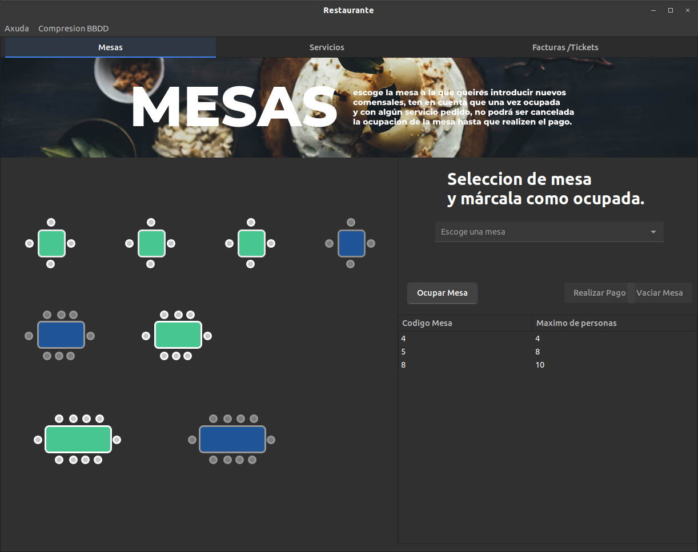
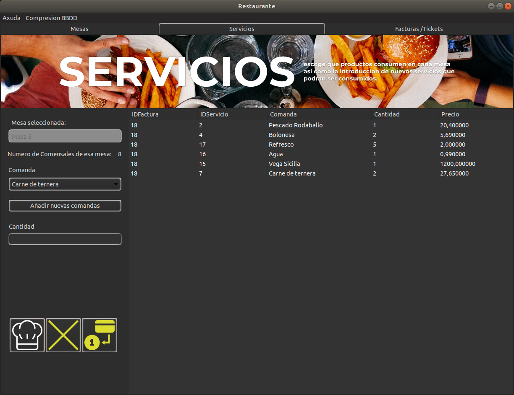
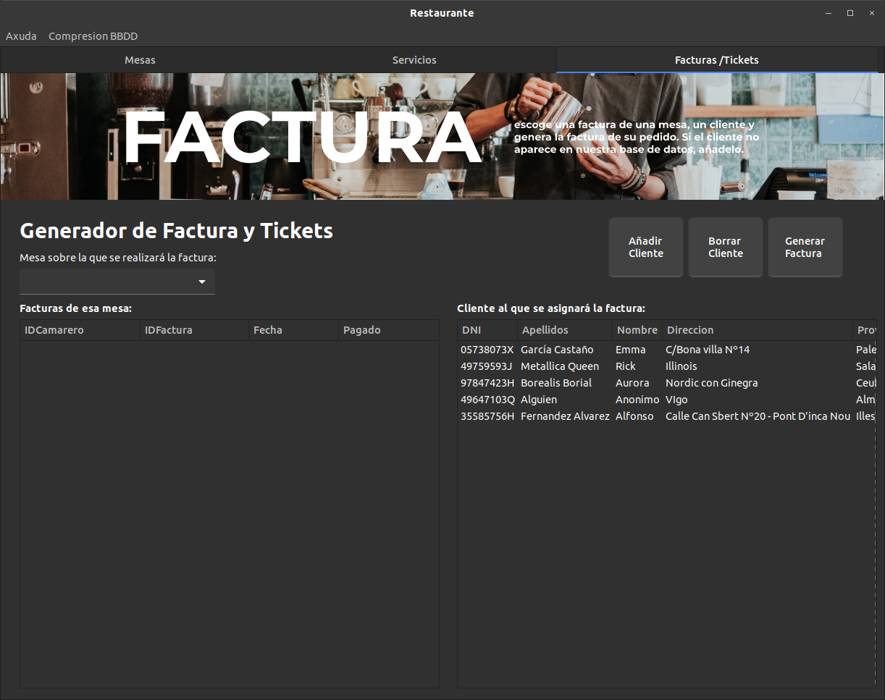
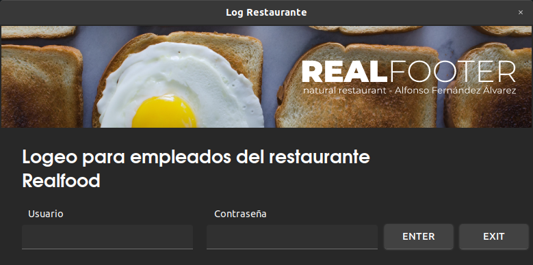

# Python---Restaurante
# Python app

   
 
 
 

## Anímate a mejorarlo!

**Creacion:** Este proyecto fue pensado a base de un trabajo del Ciclo de Desarrollod e aplicaciones Multiplataforma del Centro IES de Teis en Vigo, España.
